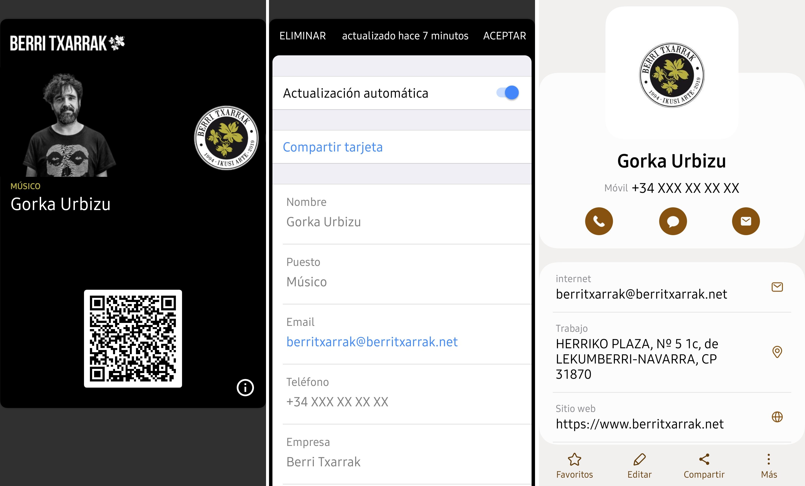

# 📲 Generación de tarjetas Apple Wallet (.pkpass)

Este sistema permite generar tarjetas digitales personalizadas para Apple Wallet a partir de los datos almacenados en la base de datos `pkpassgeneric`. Cada tarjeta incluye la información profesional de un empleado y una vCard descargable mediante código QR.



---

### ⚙️ ¿Cómo funciona?

El script `generic/vcard/index.php` se encarga de:

1. **Conectar a la base de datos**
  - Extrae los datos desde la tabla `empleados`.

2. **Procesar cada empleado**
  - Crea una carpeta individual en `/generic/vcard/users/{idcard}/`.
  - Descarga las imágenes de perfil y logo.
  - Genera imágenes necesarias para el pase (icon, logo, fondo).

3. **Generar vCard**
  - Se construye una vCard con todos los datos personales y profesionales del empleado.
  - Se guarda en `/generic/vcard/vcards/{idcard}.vcf`.

4. **Construir el pase**
  - Se genera un JSON (`pass.json`) con los datos del pase (nombre, puesto, colores, QR, etc.).
  - El QR apunta a la vCard del empleado para descarga directa.
  - Se firma el pase con el certificado adecuado (`Certificados{empresa_slug}.p12` o uno genérico).
  - El pase final se guarda como `/generic/vcard/pkpass/{idcard}.pkpass`.

### 📁 Archivos generados

- `/vcards/{id}.vcf`: Tarjeta de contacto en formato vCard 3.0.
- `/pkpass/{id}.pkpass`: Pase listo para ser añadido a Apple Wallet.
- `/users/{id}/`: Carpeta temporal con imágenes necesarias para el pase.

### 🧪 Dependencias

- [php-pkpass](https://github.com/tschoffelen/php-pkpass): Librería PHP para generar y firmar archivos `.pkpass`.
- PHP >= 8.0 (con extensión `openssl` habilitada).
- Certificado `.p12` válido proporcionado por Apple Developer.

### 🗃️ Base de datos utilizada

El sistema trabaja sobre una base de datos `pkpassgeneric`, que contiene las siguientes tablas relevantes:

- `empleados`: información personal y profesional de cada empleado.
- `distribution`: registro de dispositivos que descargan el pase (utilizado en el servicio web de actualización).

Los empleados se insertan manualmente en la base de datos antes de ejecutar el script.

### 🔒 Seguridad

- Los certificados `.p12` deben mantenerse fuera del repositorio si se publica el proyecto.
- No almacenar las contraseñas ni rutas sensibles en el código en producción.
- Es recomendable utilizar variables de entorno para las credenciales de la base de datos y certificados.

---

## 🔐 Instrucciones para generar el certificado `.p12` en macOS

### 1. Crear un Identificador de tipo Pass (Pass Type ID)

1. Accede al [Apple Developer Portal](https://developer.apple.com/account/) e inicia sesión.
2. Ve a **Certificates, Identifiers & Profiles**.
3. En el apartado **Identifiers**, haz clic en el botón ➕ para añadir un nuevo identificador.
4. Selecciona el tipo **Pass Type ID**.
5. Introduce un identificador con el siguiente formato:
   ```
   pass.com.tudominio.nombre
   ```
6. Guarda y continúa.
<br>

### 2. Generar un archivo CSR (.csr) desde tu Mac

1. Abre la aplicación **Acceso a Llaveros** (Keychain Access).
2. En la barra de menús, selecciona:
   ```
   Acceso a Llaveros > Asistente de Certificados > Solicitar un certificado a una Autoridad Certificadora…
   ```
3. Completa el formulario:
   - **Dirección de correo electrónico del usuario**: tu email del Apple ID.
   - **Nombre común**: nombre de la empresa o proyecto.
   - **CA por correo electrónico**: deja en blanco.
4. Selecciona la opción **Guardar en disco**.
5. Guarda el archivo `.csr` en tu escritorio o ubicación deseada.
<br>

### 3. Crear el certificado Pass Type ID en Apple Developer

1. Vuelve al portal de Apple Developer.
2. Selecciona el identificador de tipo **Pass Type ID** que has creado.
3. Haz clic en **Create Certificate**.
4. Sube el archivo `.csr` generado en el paso anterior.
5. Descarga el archivo `.cer` (certificado) que te ofrece Apple al finalizar.
<br>

### 4. Exportar el certificado y clave como archivo `.p12`

1. Haz doble clic en el archivo `.cer` descargado para instalarlo en el llavero.
2. En **Acceso a Llaveros**, localiza el certificado bajo **Mis certificados**.
3. Asegúrate de que está acompañado por su **clave privada** (desplegable).
4. Haz clic derecho sobre el certificado > **Exportar…**
5. Elige el formato **Personal Information Exchange (.p12)**.
6. Guarda el archivo `.p12` y establece una contraseña segura cuando te lo solicite.
<br>

### ✅ Resultado final

Ahora tienes un archivo `.p12` válido que puedes utilizar para firmar tus archivos `.pkpass`.

---